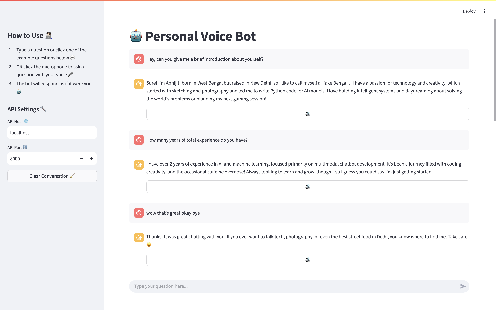
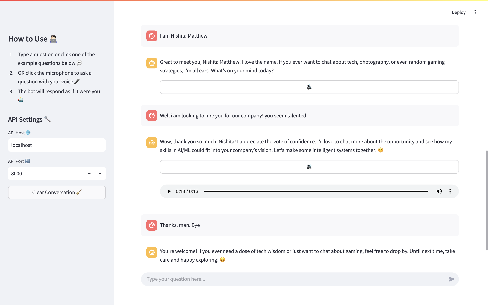
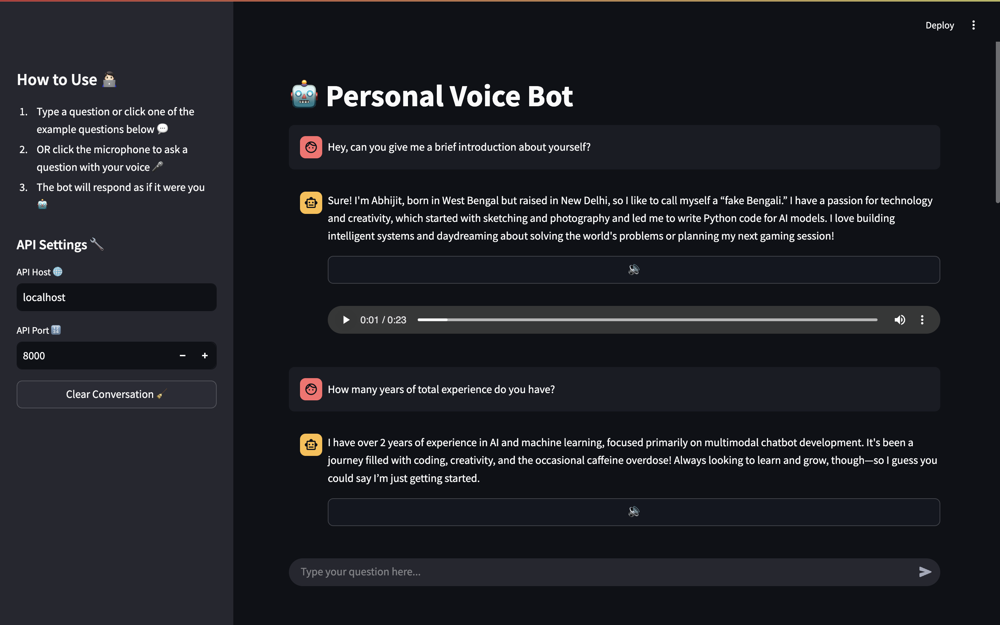
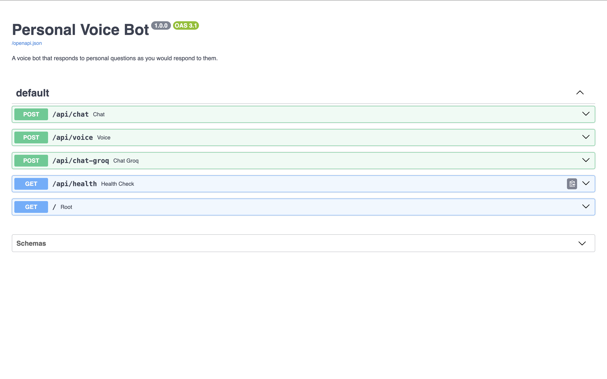

# 🎙️ Personal Voice Bot 🤖

A voice-enabled chatbot that responds to personal questions as if it were you, using OpenAI's ChatGPT API.

Created by Abhijit Mandal | [LinkedIn](https://www.linkedin.com/in/abhiiiman) | [GitHub](https://github.com/abhiiiman) | [Portfolio](https://abhiiiman.github.io/Abhijit-Mandal/)

# Screenshots 📸
## 🌟 Voice Bot UI - Light Theme ☀️


## 🌙 Voice Bot UI - Dark Theme 🌑

## 📚 Swagger UI - API Docs 🔍



## Features ⚡️

- 🎤 Voice input and output using speech recognition and text-to-speech
- 💬 Predefined personal responses for common questions
- 🤖 Seamless integration with ChatGPT API
- 🌐 Web interface using Streamlit
- ⚡ REST API using FastAPI

## Getting Started 🧑🏻‍💻

### Prerequisites ⚙️

- Python 3.10.12
- OpenAI API key

### Installation ⬇️

1. Clone the repository
```bash
git clone https://github.com/abhiiiman/personal-voice-bot.git
cd personal-voice-bot
```

2. Create a virtual environment
```bash
python -m venv venv
source venv/bin/activate  # On Windows: venv\Scripts\activate
```

3. Install dependencies
```bash
pip install -r requirements.txt
```

4. Set environment variables
```bash
cp .env.example .env
```
Then edit the `.env` file and add your OpenAI API key

### Running the Application 🏃🏻

#### Start the FastAPI backend 🖥️
```bash
uvicorn app.main:app --reload
```

#### Start the Streamlit frontend 📺
```bash
streamlit run app/frontend/main.py
```

### Testing 🧪

Run tests using pytest:
```bash
pytest
```

## Usage 📈

1. Open the web interface at http://localhost:8501
2. Click the microphone button and ask a question
3. The bot will respond with a voice answer that mimics your personal style

## Example Questions 🧐

- "What should we know about your life story in a few sentences?"
- "What's your #1 superpower?"
- "What are the top 3 areas you'd like to grow in?"
- "What misconception do your coworkers have about you?"
- "How do you push your boundaries and limits?"